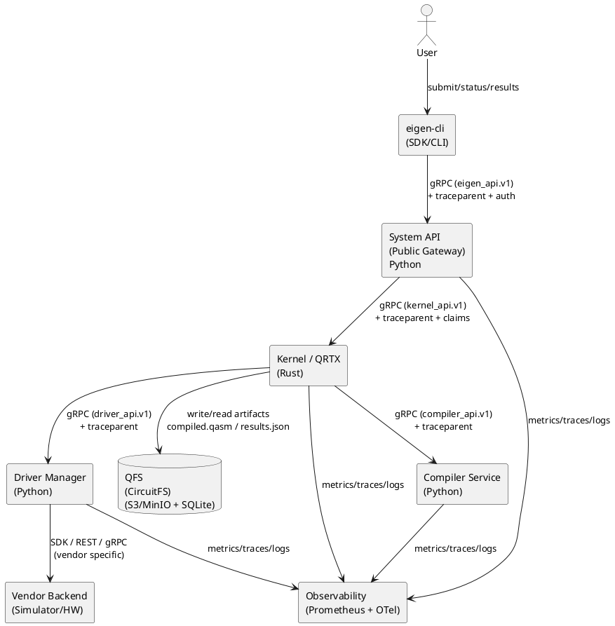
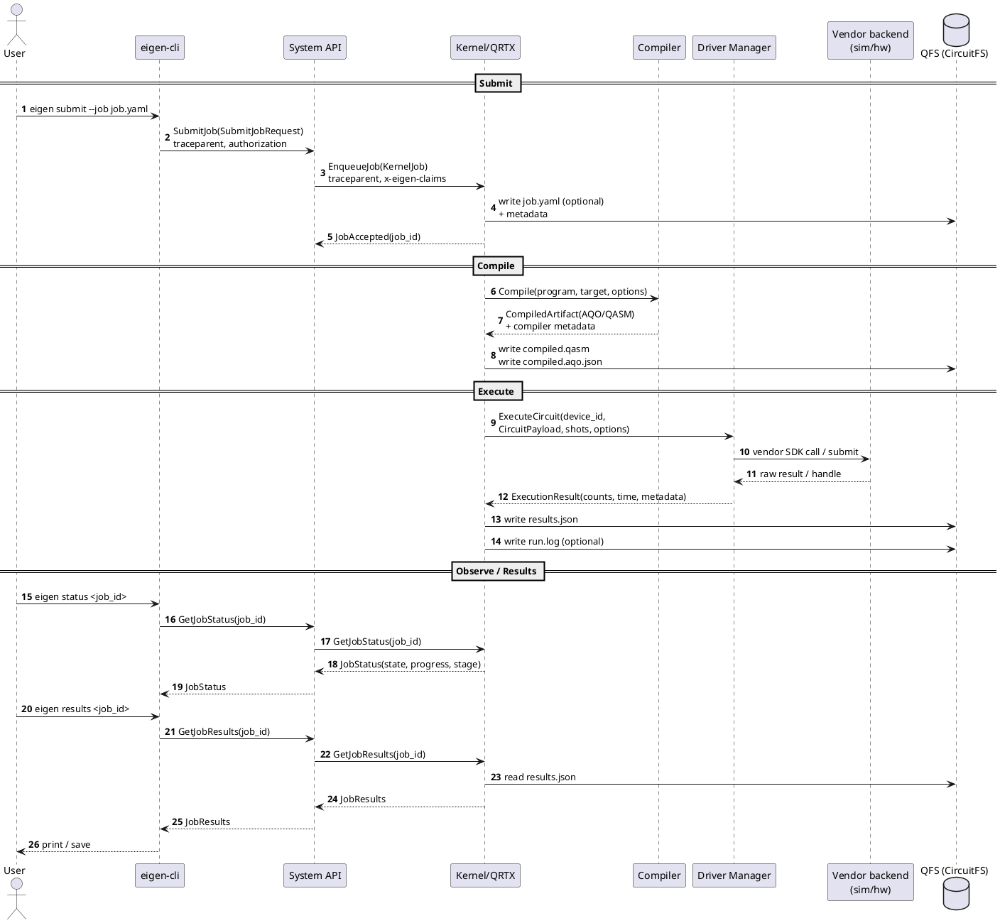

# Eigen OS — MVP Contract Map (end‑to‑end: user → qubit → user)

>    **Purpose**: A single "interface map" for developers during the architectural design phase. Reflects the agreed-upon contracts after RFC acceptance.

## 0) Boundaries and Versions (MVP Contracts)

### Services/Layers (MVP)
- **User / SDK / eigen-cli** → **System API** (public entry point, gRPC).
- **System API** → **Kernel (QRTX)** (internal workflow/DAG orchestrator).
- **Kernel (QRTX)** → **Compiler service** (Python compilation: Eigen‑Lang/IR → AQO/QASM).
- **Kernel (QRTX)** → **Driver Manager** (manages drivers and backend connections).
- **Driver Manager** → **Vendor backend / Simulator / Hardware** (low-level calls, simulator in MVP).
- **Kernel (QRTX)** ↔ **QFS** (CircuitFS for artifacts and results).

### API Versioning
- **Public gRPC API**: eigen_api.v1.
- **Internal gRPC APIs**:
  - `kernel_api.v1` — KernelGateway (System API ↔ Kernel)
  - `compiler_api.v1` — CompilerService (Kernel ↔ Compiler)
  - `driver_api.v1` — DriverManagerService (Kernel ↔ Driver Manager)
  - **Job Specification Format**: `JobSpec v0.1` (`apiVersion: eigen.os/v0.1`).

>    Important: The `monitoring.proto` and `auth.proto` files are **not part of the public gRPC API in MV**P. Metrics are available via HTTP (`/metrics`), authentication is handled by System API interceptors. (RFC 0004). 

---

## 1) Component Diagram (UML / PlantUML)

---

## 2) E2E Flow (sequence) "from user to qubit and back"

### Task States
Basic state line (client-facing): `PENDING → COMPILING → QUEUED → RUNNING → DONE/ERROR`.
Detailed kernel state machine is defined in RFC 0007.

---

## 3) Public API Contracts (System API) — eigen_api.v0.1

Below is the **"MVP freeze" level contract:** fields, errors, idempotency, side effects.
(The implementation may proxy to Kernel/Compiler, but the external contract is the same.)

### 3.1 JobService (eigen_api.v0.1)
**RPC: SubmitJob**
- **Input**: `SubmitJobRequest`
  - `name` (string, required)
  - `program` (oneof): `eigen_lang_source` | `qasm3` | `aqo_json_ref` | …
  - `target` (string / message): device type or device_id
  - `priority` (optional)
  - `compiler_options` (map<string,string>)
  - `metadata` (map<string,string>)
- **Output**: `SubmitJobResponse { job_id, accepted_at }`
- **Idempotency**: It is recommended to accept a `client_request_id` (uuid) in metadata and maintain deduplication (48–72 hours).
- **Side effects**: Creates a Job record and places JobSpec/artifacts in QFS (optional).

**RPC: GetJobStatus**
- **Output**: `JobStatusResponse { job_id, state, stage, progress, updated_at, message }`

**RPC: CancelJob**
- **Semantics**:
  - CANCELLED is allowed if job is in PENDING/COMPILING/QUEUED; if RUNNING — best effort.
  - Returns `FAILED_PRECONDITION` if job is already DONE/ERROR.
- **Side effects**: Sends cancel to Kernel and marks the job.

**RPC: GetJobResults**
- **Output**: `JobResultsResponse { job_id, results, artifacts_refs[], metadata }`
- **Large artifacts**: QFS refs instead of raw bytes.

**RPC: StreamJobUpdates**
- The MVP implementation uses **poll‑based streaming**: System API polls the Kernel and emits events to the client. (RFC 0004).

### 3.2 DeviceService (eigen_api.v0.1)
**RPC: ListDevices**
- Returns aggregated view: capabilities + status.

**RPC: GetDeviceStatus(device_id)**
- Returns `DeviceStatus` (online/offline, queue_depth, estimated_wait, calibration_age…).

**RPC: ReserveDevice(device_id, ttl)**
- Clear semantics: reserves a scheduler slot in the Kernel Resource Manager, not hardware-wide exclusive lock. (RFC 0004).

### 3.3 CompilationService (eigen_api.v0.1)
- **Note for MVP**: The `CompilationService` **is not part of the public MVP API**. The `eigen-cli compile` command performs **local compilation**. (RFC 0010, RFC 0004).

---

## 4) Internal Contracts (Inter-service gRPC)

### 4.1 System API ↔ Kernel: KernelGateway (kernel_api.v1)
**RPC: EnqueueJob**
- Input: `KernelJob { job_id?, submitter, program_ref/bytes, target, priority, trace_context, auth_claims }`
- Output: `EnqueueJobResponse { job_id }`

**RPC: GetJobStatus / CancelJob / GetJobResults**
- Must **semantically match** the public responses (System API should not "invent" statuses).

### 4.2 Kernel ↔ Compiler: CompilerService (compiler_api.v1)
**RPC: Compile**
- Input: `CompileRequest { job_id, program(oneof), target, options }`
- Output: `CompileResponse { artifact(oneof ref/bytes), format(enum), stats, metadata }`
- Output formats must match what Driver Manager understands (`CircuitPayload.format`).

### 4.3 Kernel ↔ Driver Manager: DriverManagerService (driver_api.v1)
Required minimum (MVP):
- `ListDevices()` → `ListDevicesResponse { devices[] }`
- `GetDeviceStatus(device_id)` → `DeviceStatusResponse { status }`
- `ExecuteCircuit(device_id, payload, shots, options)` → `ExecuteCircuitResponse { results, timing, metadata }`
- `CalibrateDevice(device_id)` → `CalibrateDeviceResponse { ... }` (can be deferred)

---

## 5) Cross-Cutting Rules: Errors, Timeouts, Tracing, Compatibility

### 5.1 Unified Error Policy
In gRPC, **an error must be returned as a status code + message**, not as `success=false` in the response.
For structured details (validation, resources, retry hints), `google.rpc.Status` (rich error model) is recommended.

**Recommendation for Eigen OS (MVP):**
- External and internal services:
  - use gRPC status codes
  - attach `google.rpc.Status` details if necessary (BadRequest, ErrorInfo, ResourceInfo)
- "Internal backend errors" (e.g., vendor SDK returned "device busy") should be mapped to:
  - `FAILED_PRECONDITION` / `RESOURCE_EXHAUSTED` / `UNAVAILABLE` depending on nature.

**Base Table:**
- INVALID_ARGUMENT — invalid request fields
- FAILED_PRECONDITION — valid request, but system in wrong state
- RESOURCE_EXHAUSTED — quotas/limits/queues exhausted
- UNAVAILABLE — temporary backend unavailability
- DEADLINE_EXCEEDED — RPC execution timeout
- UNAUTHENTICATED / PERMISSION_DENIED — auth/authz
- NOT_FOUND — job_id/device_id not found

### 5.2 Timeouts
- External RPC: client sets deadline; System API propagates it downwards.
- ExecuteCircuit: almost always async by job_id; "long" operations should not hold a single RPC open unnecessarily.

### 5.3 Tracing and Correlation
OpenTelemetry recommends context propagation via W3C TraceContext (`traceparent`). 
Recommended policy (MVP):  
- System API accepts `traceparent` and propagates it to Kernel/Compiler/DriverManager via gRPC metadata.
- Logs/metrics are enriched with tra`ce_id, `job_id`, `device_id`.

### 5.4 Single Source of Truth for Protobuf + Breaking Check
To ensure interfaces "always match", establish a single protocol module and CI checks:
- `buf lint`
- `buf breaking` against the latest release.
Buf can detect breaking changes and fits well into CI. (RFC 0004).

---

## 6) "Interface Matrix" (Contract Map) — Who Calls Whom and With What

### 6.1 External Layer
| **Caller** | **Callee** | **Proto/package** | **RPC** | **Type** | **Data** |
|---|---|---|---|---|---|
| eigen-cli/SDK | System API | eigen_api.v1 | SubmitJob | sync | JobSpec→SubmitJobRequest |
| eigen-cli/SDK | System API | eigen_api.v1 | GetJobStatus | sync | job_id |
| eigen-cli/SDK | System API | eigen_api.v1 | GetJobResults | sync | job_id (+ artifacts refs) |
| eigen-cli/SDK | System API | eigen_api.v1 | StreamJobUpdates | stream | job_id |
| eigen-cli/SDK | System API | eigen_api.v1 | ListDevices/GetDeviceStatus | sync | catalog/status |

### 6.2 Orchestration Layer
| **Caller** | **Callee** | **Proto/package** | **RPC** | **Type** | **Data** |
|---|---|---|---|---|---|
| System API | Kernel | kernel_api.v1 | EnqueueJob | sync | job + claims + trace |
| System API | Kernel | kernel_api.v1 | GetJobStatus/GetJobResults/Cancel | sync | job_id |
| Kernel | Compiler | compiler_api.v1 | Compile | sync/async | program + target + options |
| Kernel | Driver Manager | driver_api.v1 | ExecuteCircuit | sync/async | device_id + CircuitPayload |
| Kernel | QFS | — | read/write | io | compiled.*, results.*, logs |

### 6.3 Low-Level Layer
| **Caller** | **Callee** | **Contract** | **Type** | **Data** |
|---|---|---|---|---|
| Driver Manager | Vendor backend | vendor SDK/REST | sync/async | compiled circuit + shots |
| Vendor backend | Driver Manager | vendor response | sync/async | raw results / handles |

---

## 7) Final Action Plan (Before Coding Starts)

The RFCs have resolved the architectural misalignments. The final steps are:

1) **Formalize RFC Acceptance**: Move key RFCs (0002, 0003, 0004, 0005, 0006, 0007) to "**Accepted**" status. This signals the contract freeze for MVP.

2) **Create Implementation Epic**: Create a master issue "Phase 0: MVP Implementation" and break it down into tasks mirroring the services:

   - system-api (based on RFC 0004, 0009)

   - eigen-kernel (based on RFC 0007)

   - eigen-compiler (based on RFC 0011, 0012)

   - driver-manager (based on RFC 0006)

   - eigen-cli (based on RFC 0010, 0003)

   - observability stack (based on RFC 0008)

3) **Start Coding**: Use this Contract Map and the accepted RFCs as the single source of truth for implementation.

4) **Track Success Criterion**: Focus on the Phase 0 success metric: 
`eigen-cli submit --job job.yaml` executes a full VQE cycle on a simulator and returns results.

---

## 8) Appendix: Rules for Compatible Changes

- Do not rename package/service/method (this is breaking).

- Adding new fields to a request is **not** wire-breaking, but can become behaviorally breaking if the server starts requiring them.

- For breaking changes — use a new package `...v2` and maintain support for v1 alongside it.

