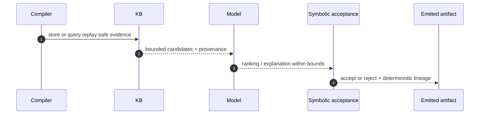

# Eigen OS — How it works for contributors

- **Document status:** Contributor guide
- **Scope:** Compiler → KB → model → symbolic acceptance → emitted artifact
- **Audience:** New contributors who need the end-to-end pipeline before reading code
- **Last updated:** 2026-06-24

This guide explains the canonical dataflow that connects the compiler, the knowledge base (KB), the model layer, the symbolic acceptance path, and the emitted artifact. The detailed contracts live in the linked architecture and reference documents; this page is the fast path for understanding the pipeline first.

## Read order

1. [`docs/architecture/data-flow.md`](data-flow.md)
2. [`docs/architecture/components/neuro-symbolic-core.md`](components/neuro-symbolic-core.md)
3. [`docs/architecture/components/compiler.md`](components/compiler.md)
4. [`docs/architecture/components/knowledge-base.md`](components/knowledge-base.md)
5. [`docs/architecture/components/gnn-optimizer.md`](components/gnn-optimizer.md)
6. [`docs/reference/api/grpc-internal.md`](../reference/api/grpc-internal.md)
7. [`docs/reference/formats/aqo.md`](../reference/formats/aqo.md)

## End-to-end picture

```text
Compiler
  → KB retrieval
  → model ranking / explanation
  → symbolic acceptance
  → emitted artifact
```



The same path is used for replay, but the replay run must use the frozen snapshots and stored provenance recorded with the original decision.

## 1. Compiler: produce the deterministic candidate set

The compiler is the first authoritative stage.

It:
- parses Eigen-Lang,
- validates syntax and semantics,
- resolves the workload profile,
- generates a bounded symbolic candidate set,
- emits replay evidence for the accepted and rejected rule chain,
- produces the compiler-side artifact that downstream stages consume.

The compiler must remain deterministic. If advisory input is missing or invalid, the compiler still runs its symbolic baseline.

The important output from this stage is not only the lowered IR, but also the normalized metadata that lets later stages replay the same decision.

Relevant contracts:
- [`docs/architecture/components/compiler.md`](components/compiler.md)
- [`docs/architecture/components/neuro-symbolic-core.md`](components/neuro-symbolic-core.md)

## 2. KB: store and retrieve replay-safe evidence

The KB is the retrieval and provenance layer.

It stores:
- compiler traces,
- decision logs,
- candidate patterns,
- canonical patterns,
- snapshot and model-policy bindings.

It returns:
- replay-safe candidates,
- canonical matches,
- provenance that identifies the input snapshot, source records, and deterministic selection path.

The KB does not invent truth. It returns bounded evidence that the deterministic pipeline can reuse.

A contributor should read KB results as: “this is the replay-safe record of what happened before,” not “this is the authority that decides legality.”

Relevant contracts:
- [`docs/architecture/components/knowledge-base.md`](components/knowledge-base.md)
- [`docs/reference/api/grpc-internal.md`](../reference/api/grpc-internal.md)

## 3. Model: rank, explain, or suggest within bounds

The model layer is advisory only.

It may:
- rank candidate options,
- produce bounded confidence values,
- explain why one deterministic option was preferred,
- surface a suggestion for the deterministic selector.

It may not:
- invent new candidates,
- change legality,
- override policy,
- become the source of truth for acceptance.

The model uses the KB evidence, but it does not replace the symbolic core. The same normalized KB input must produce the same replay identity and the same candidate ordering whenever determinism is required.

Relevant contracts:
- [`docs/architecture/components/neuro-symbolic-core.md`](components/neuro-symbolic-core.md)
- [`docs/architecture/components/compiler-neuro-symbolic-advisor.md`](components/compiler-neuro-symbolic-advisor.md)
- [`docs/reference/compiler-observability-contract.md`](../reference/compiler-observability-contract.md)

## 4. Symbolic acceptance: decide what is allowed

Symbolic acceptance is the deterministic gate.

It checks:
- legality,
- policy,
- compatibility,
- replay identity,
- whether a suggested rewrite or mapping stays inside the accepted contract.

If the model suggests something useful, the symbolic gate still has to approve it. If the suggestion is missing, malformed, or low-confidence, the symbolic baseline still runs.

This is the step that turns “advisory” into “accepted” or “rejected.”

Relevant contracts:
- [`docs/architecture/components/neuro-symbolic-core.md`](components/neuro-symbolic-core.md)
- [`docs/architecture/components/compiler.md`](components/compiler.md)
- [`docs/reference/rewrite-outcome-taxonomy.md`](../reference/rewrite-outcome-taxonomy.md)

## 5. Emitted artifact: write the validated output

After symbolic acceptance, the pipeline emits the artifact that downstream systems consume.

That artifact is typically one of:
- validated AQO,
- a transformed execution plan,
- a persisted result bundle,
- lineage refs and provenance metadata stored alongside the artifact.

The emitted artifact must be traceable back to:
- the original request,
- the KB snapshot and records used,
- the model snapshot used for ranking or explanation,
- the symbolic rule chain that accepted or rejected the final path.

Relevant contracts:
- [`docs/reference/formats/aqo.md`](../reference/formats/aqo.md)
- [`docs/reference/formats/qfs-layout.md`](../reference/formats/qfs-layout.md)
- [`docs/reference/api/grpc-internal.md`](../reference/api/grpc-internal.md)

## 6. What changes between compile, replay, and explanation

The dataflow is the same, but the intent changes:

- **Compile:** produce the allowed artifact for the current input.
- **Replay:** reproduce the original decision using frozen snapshots and stored provenance.
- **Explain:** expose why the accepted path won over the rejected ones.

The pipeline stays stable because the deterministic steps stay stable. Only the snapshot inputs and the selected replay path change.

## 7. Quick mental model

If you only remember one thing, remember this:

- the **compiler** creates a deterministic candidate set,
- the **KB** stores and returns replay-safe evidence,
- the **model** ranks or explains within bounds,
- the **symbolic gate** decides what is legal,
- the **emitted artifact** is the validated result plus lineage.

That is the whole loop.

## 8. Where to go next

- For the system-wide flow, read [`docs/architecture/data-flow.md`](data-flow.md).
- For the compiler boundary, read [`docs/architecture/components/compiler.md`](components/compiler.md).
- For replay-safe retrieval and provenance, read [`docs/architecture/components/knowledge-base.md`](components/knowledge-base.md).
- For the symbolic/model boundary, read [`docs/architecture/components/neuro-symbolic-core.md`](components/neuro-symbolic-core.md).
- For the wire contract, read [`docs/reference/api/grpc-internal.md`](../reference/api/grpc-internal.md).
